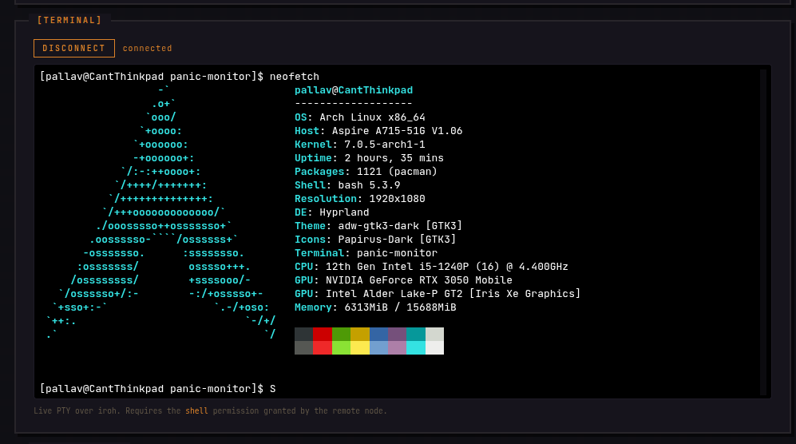

# Panic Monitor

<p align="center">
  
</p>

> Sovereign, peer-to-peer health monitoring for your homelab -- no central
> server, no open ports, no cloud. Free and open source.

Most fleet monitors make you stand up a server, open a port, or hand your
metrics to someone else's cloud. Panic Monitor doesn't. It's a peer-to-peer
health monitor for the homelab where every node *is* the infrastructure -- no
central server, no broker, no SaaS, nothing to forward. Each box runs one daemon
with its own cryptographic identity, finds its peers directly over an encrypted
mesh, punches through NAT on its own, and falls back to relay only when it has
to. From any node you get the whole fleet at a glance -- live CPU, memory, disk,
containers, processes, and logs pulled straight off each peer, plus uptime
windows, heartbeat history, and an incident log so you can see not just *what's*
down but *what happened*. Authority is explicit and signed: peers trust each
other by key, and every capability is a grant you make, not a port you expose.
You hold the keys, you own the data, and there's no one in the middle -- by
design, not as an upsell.

Each node is sovereign -- there's no central server. Nodes form a flat-peer
mesh over [Iroh](https://iroh.computer/) QUIC connections, and access control is
an append-only, cryptographically signed log per node.

- **Heartbeat probing** with configurable thresholds, flap suppression, and webhook alerts
- **Two web surfaces** -- a login-gated **control dashboard** on `:42069` (full interactive UI: global status bar, monitor sidebar, multi-window uptime (24h/7d/30d), heartbeat history, latency sparkline, incident log, peer/permission/shell controls) and a no-auth **read-only status page** on `:8080` (`/status.json` for uptime checkers). See [Dashboard](#dashboard).
- **System stats** -- CPU, memory, disk, load, temperature, top-N processes
- **Docker diagnostics** -- per-container CPU/MEM/net/block-IO, ports, mounts, health, logs
- **Cross-device stats** -- pull live stats from peers over iroh QUIC, delta-synced
- **Self-healing transport** -- detects and escapes broken/colliding peer addresses (stale IPv6, `docker0` collisions) automatically
- **Cryptographic audit trail** -- every trust mutation and state transition is signed
- **Local-first storage** -- SQLite history + logstore, no external services

<p align="center">
  
</p>

---

## Install

### Easy install (recommended)

No Python, no virtualenv, no building anything. One command downloads a
ready-to-run program for your computer and sets it up:

```sh
curl -fsSL https://raw.githubusercontent.com/Pallav0099/panicmonitr/main/install.sh | sh
```

That's the whole install. It figures out which build your machine needs,
downloads it, checks it wasn't tampered with, and adds the `panic-monitor`
command. Works on **Linux** -- both regular PCs/servers (`x86_64`) and ARM
boards like the Raspberry Pi (`aarch64`), on any reasonably modern system
(Debian 12+, Ubuntu 22.04+, Fedora 36+, or newer).

- **Want it available for every user on the machine?** Run it with `sudo`:
  ```sh
  curl -fsSL https://raw.githubusercontent.com/Pallav0099/panicmonitr/main/install.sh | sudo sh
  ```
- **Prefer to read a script before running it?** (Good instinct.) Download
  [`install.sh`](install.sh), open it in a text editor, then run `sh install.sh`.
- **See `panic-monitor: command not found` afterwards?** It installed to
  `~/.local/bin`, which isn't on your `PATH` yet. Fix it once:
  ```sh
  echo 'export PATH="$HOME/.local/bin:$PATH"' >> ~/.bashrc && source ~/.bashrc
  ```

### From source (developers)

Needs **Python 3.12+**. The binary above bundles its own interpreter, so this
path is only for hacking on the code:

```fish
git clone https://github.com/Pallav0099/panicmonitr.git && cd panicmonitr
python3 -m venv .venv && source .venv/bin/activate   # fish: .venv/bin/activate.fish
pip install -e .
```

### Upgrading

Re-run the same one-liner -- it overwrites the binary in place and, if a
`panic-monitor` service is enabled, **restarts it** so the new version takes
effect immediately:

```sh
curl -fsSL https://raw.githubusercontent.com/Pallav0099/panicmonitr/main/install.sh | sh
```

Your state -- identity (`secret.key`/`secret.meta`), trust log, peer cache, and
history DBs -- lives in your config/data dirs and is **never touched** by an
upgrade; your stored password backend is preserved too. If you re-render the
systemd unit (`panic-monitor --install-service --force`), that now restarts an
already-running daemon as well (older versions left the running process on the
old binary). Dashboard logins survive the restart, so any open tab stays signed
in.

---

## Quick start

Once it's installed, run this on **both** machines:

```fish
# Init + start
panic-monitor --init              # generates signing identity, prompts for password
panic-monitor --install-service   # wires up systemd, encrypts password, starts daemon

# Exchange identities
panic-monitor --show-identity     # prints 64-char hex Node ID -- share it

# Trust each other
panic-monitor --add-peer <THEIR_NODE_ID> --alias "my-server" --permissions monitor
```

Open `http://127.0.0.1:42069/` and sign in with your identity password. After
both sides add each other, the peer appears in the fleet view within one probe
interval (30s default). Click any card to see live CPU, memory, disk, processes,
and containers.

After `--install-service`, admin commands talk to the running daemon over the
control socket -- no restarts. Read-only commands (`--list-peers`, `--uptime`,
...) need nothing; the **sensitive trust mutations** (`--add-peer`,
`--set-permissions`, `--add-permission`) prompt for your identity password to
authorize the change.

---

## Prerequisites

- **Linux** with systemd (any recent version -- see password backends below)
- **Python 3.12+** -- only for the *from source* install; the prebuilt binary bundles its own
- **Docker** (optional -- pass `--no-docker` to skip container stats)

### Password backends

`--install-service` stores your identity password so the daemon can unlock itself
at boot. It **auto-selects** the backend -- you don't normally pass anything:

| Backend | When auto-chosen | How it protects the password |
|---|---|---|
| `systemd-creds` | systemd >= 250 (system) / >= 256 (user) | host-bound, encrypted via systemd's credential key |
| `machine-id` | anything older, or headless | encrypted at rest, key derived from `/etc/machine-id` (argon2id) -- works on any distro with no D-Bus/keyring |

So on current LTS distros (Ubuntu 22.04/24.04, Debian 12 -- all < systemd 256 in
user mode) and on headless servers, install **just works** via the portable
`machine-id` backend. The `machine-id` ciphertext is bound to the host: copying
it to another machine yields nothing. It is encryption *at rest*, not protection
against a process already running as your user on the same box -- for that, use a
systemd >= 256 host with `systemd-creds`.

Force a specific backend with `--password-from {systemd-creds,machine-id,keyring,env,stdin,pinentry}`.

---

## Peers

The trust model is **default-deny**. No peer can probe, push, or query this
node until you add their Node ID to your trust log.

```fish
# Add
panic-monitor --add-peer <NODE_ID> --alias "api-server" --permissions monitor --tags "prod,critical"

# List / filter / revoke
panic-monitor --list-peers
panic-monitor --list-peers --filter-tag prod
panic-monitor --revoke-peer <NODE_ID>        # signed op, auditable

# Permissions (signed ops). Two verbs:
panic-monitor --add-permission api-server shell        # ADDS, keeps existing -> monitor,shell
panic-monitor --set-permissions api-server "monitor,shell"  # REPLACES the whole set

# Tags
panic-monitor --set-tags api-server "prod,db"
panic-monitor --add-tag api-server staging
panic-monitor --remove-tag api-server staging

# Maintenance -- suppresses alerts, probes still run
panic-monitor --set-maintenance api-server +0 +2h
panic-monitor --clear-maintenance api-server
```

`--add-peer`, `--set-permissions`, and `--add-permission` are gated by your
**identity password** (you'll be prompted) -- the same password that unlocks
your signing key. `--add-permission` adds to the existing set; `--set-permissions`
replaces it wholesale.

Trust is **per-direction** -- for full bidirectional monitoring, both sides
must `--add-peer` each other with at least `monitor` permission.

---

## Permissions

Per-peer, per-protocol, granted on your trust log:

| Permission | Grants |
|---|---|
| `monitor` | Everything -- probing, stats, container logs, push, sync. Default. |
| `view_dashboard` | Dashboard + container-logs only (no probe target). |
| `shell` | Interactive remote `bash` via the dashboard terminal. |
| `chat` / `split` / `call` / `drop` | Reserved for future PanicLab protocols. |

All ALPN handlers that need `view_dashboard` also accept `monitor` as
fallback. The default `monitor` permission is sufficient for the full
feature set **except the remote shell**.

### Remote shell (`shell`)

The dashboard terminal lets you open a live PTY-backed `bash` on a peer --
arrow keys, `vim`/`top`, tab-completion, resize. This is effectively
authenticated RCE into that node, so it is **strictly default-deny**:

<p align="center">
  
</p>

- A peer can open a shell on you **only** if you granted them the `shell`
  permission. It is **not** implied by `monitor` or `view_dashboard` (no
  fallback). The `*` wildcard *does* grant it -- avoid `*` if you don't want
  shell exposure.
- The dashboard at `:42069` is loopback-only and **login-gated** (see
  [Dashboard](#dashboard)): opening a shell requires an authenticated dashboard
  session (you sign in with your identity password), and the WebSocket is
  rejected from foreign browser origins.
- Every session is recorded as a signed, tamper-evident `shell_open` /
  `shell_close` op in the **host's** trust log (`log.jsonl`).
- Under system-mode systemd the spawned shell inherits the unit's sandbox
  (`ProtectSystem=strict`, `ProtectHome=yes`, `SystemCallFilter=@system-service`)
  and runs as the daemon user; user-mode installs are unsandboxed.

```fish
# Let api-server open shells on this node (grant at add time)
panic-monitor --add-peer <NODE_ID> --alias api-server --permissions monitor,shell

# Or grant shell to a peer you already trust. --set-permissions REPLACES the
# full set, so include the perms you want to keep (e.g. monitor):
panic-monitor --set-permissions api-server "monitor,shell"
```

---

## Security model

Three surfaces, three layers of authentication:

- **Identity** -- each node has an Ed25519 keypair; the secret key is sealed at
  rest under an argon2id key derived from your password (`secret.key`).
- **Trust is an append-only signed log** -- default-deny, per-peer, per-protocol
  grants; `peers.json` is only a cache re-materialized from the log.
- **Peer-to-peer (iroh):** every QUIC connection is authenticated by the peer's
  Node ID (its public key) in the TLS handshake, and handlers authorize *that*
  identity against the trust log. A peer can't impersonate another or forge data
  for one -- identity comes from the connection, never the request payload.
- **Control socket (CLI ↔ daemon):** a `0600` Unix socket, with every request
  checked via `SO_PEERCRED` so only the daemon's own user can drive it.
- **Dashboard (`:42069`):** loopback-only, behind a **login page** -- you sign in
  with your identity password and get a signed, `HttpOnly`, `SameSite=Strict`
  session cookie, on top of an `Origin`/`Host` allowlist (blocks browser CSRF /
  DNS-rebinding). The session key is derived from the node seed, so logins
  survive a daemon restart. The read-only status page on `:8080` stays open.
- **Remote shell** is a dedicated `shell` grant, never implied by `monitor`, and
  every session is a signed `shell_open`/`shell_close` entry in the trust log.

---

## Roles

`--role {monitored,monitoring,both}` (default: `both`):

| Role | Collects own stats | Pulls peer stats | Use case |
|---|---|---|---|
| `monitored` | Yes | No | Headless servers |
| `monitoring` | No | Yes | Dashboard-only nodes |
| `both` | Yes | Yes | Default, bidirectional pairs |

---

## Dashboard

The daemon serves **two HTTP surfaces, both bound to `127.0.0.1`**, with
deliberately different jobs:

| Port | Plane | Auth | What it's for |
|---|---|---|---|
| **`:42069`** | **Control plane** (Flask + Plotly) | **login** + Origin/Host allowlist | The full interactive dashboard. Live per-node CPU/mem/disk/process/container detail, heartbeat + latency + incident history, **and every mutation**: add/revoke peers, change permissions, open PTY shells. Read **and** write. |
| **`:8080`** | **Viewing plane** (stdlib `http.server`) | none (read-only) | A lightweight at-a-glance status page plus a machine-readable `/status.json`. Strictly read-only -- no controls, no shell, nothing to authenticate. Safe to point a status board or uptime checker at. |

In short: **`:42069` is where you *operate* the mesh, `:8080` is where you (or a
script) just *look* at it.** The control plane can do everything the viewing
plane shows, so if you only need to glance at status, `:8080` is the surface to
use — and the only one meant to be scraped.

- **`:42069`** is configured with `--dashboard-port` (set `0` to disable it).
- **`:8080`** is configured with `--status-bind` (e.g. `--status-bind ""` to
  disable, or `--status-bind 127.0.0.1:9000` to move it).

### Control plane (`:42069`)

The control dashboard is behind a **login page**. Just open it and sign in:

```fish
xdg-open http://127.0.0.1:42069/     # then enter your identity password
```

The login sets a signed session cookie (`HttpOnly`, `SameSite=Strict`). The key
that signs it is derived from the node's seed, so the session **survives a
daemon restart or upgrade** -- no re-fetching a URL, no token to paste. Once
signed in, trusting a peer, changing permissions, and opening a shell all work
without a further prompt; `[Logout]` (top-right) ends the session. For
read-only viewing without logging in, use the `:8080` status page.

> **Never reverse-proxy `:42069` to a public interface without your own auth
> layer in front.** The login is designed for same-host use; a proxy that
> rewrites `Host`/`Origin` defeats the allowlist, and anyone who reaches the
> port gets full dashboard access -- including PTY shells into peers that
> granted you `shell`. Keep it on `127.0.0.1`; tunnel over SSH or a mesh VPN
> (which bring their own auth) if you need it remotely.

The main dashboard at `:42069` renders once and polls JSON. Scroll position,
expanded containers, and hover state survive every refresh. The layout is built
for glancing, not reading:

- **Global status bar** (sticky) -- one dot answering "is everything okay?",
  an up/down/maintenance tally, and the single worst-uptime node.
- **Monitor sidebar** -- every node as a colour-coded row; anomalies pop.
- **Per-node detail** -- multi-window uptime (24h/7d/30d), a heartbeat bar
  (one block per probe), a latency sparkline, an incident log, plus the full
  system/process/container/log depth.
- **Incident history** -- a dedicated full-history page at
  `/incidents/<node_id>` for reading days of outages without scrubbing.

Open any node to read its whole system -- live, straight off the peer:

<p align="center">
  
  
</p>

See [docs/dashboard.md](docs/dashboard.md) for the full UI reference.

### Viewing plane (`:8080`)

A tiny, dependency-free status page served by the stdlib HTTP server — the
"is everything up?" glance with **no login**. It exposes:

- `GET /` — a compact HTML status page (fleet roll-up + per-node up/down).
- `GET /status.json` — the same data as JSON, for an uptime checker, a wall
  display, or your own status board.
- `GET /history.json?node_id=<id>&hours=<n>` — a peer's recent probe history
  (RTT + status), capped at 30 days.

It is **read-only by design**: there are no mutation routes, no shell, and
nothing to authenticate, so it's the surface to scrape or (cautiously) expose.
It still binds to `127.0.0.1` by default — `--status-bind 0.0.0.0:8080` opens it
to the network, and since it carries no auth, only do that on a trusted LAN.

```fish
panic-monitor --daemon --dashboard-port 0            # disable :42069 control plane
panic-monitor --daemon --status-bind ""              # disable :8080 status page
panic-monitor --daemon --status-bind "0.0.0.0:8080"  # expose :8080 (no auth!)
```

---

## Webhooks

```fish
panic-monitor --daemon --webhook-url "https://ntfy.sh/your-topic"
panic-monitor --test-webhook --webhook-url "https://ntfy.sh/your-topic"
```

Fires on `monitor_down` / `monitor_up` transitions. Suppressed during
maintenance. Flap protection via `--flap-min-dwell` (default 60s).

---

## State files

User mode (default):

```
~/.config/panic-monitor/
    secret.key       sealed signing key (0600)
    secret.meta      Node ID + argon2 salt (0600)
    peers.json       materialized peer cache
    log.jsonl        append-only signed trust log
    password.cred    encrypted password -- systemd-creds backend (0600)
    password.enc     encrypted password -- machine-id backend (0600)
    password.salt    argon2 salt for the machine-id backend (0600)

~/.local/share/panic-monitor/
    history.db       probe latency + status timeseries
    logstore.db      system/container stats + rollups

$XDG_RUNTIME_DIR/panic-monitor/
    control.sock     daemon <-> CLI IPC (0600, owner-only)
```

Only one of `password.cred` / `password.enc`+`password.salt` exists, depending
on the chosen password backend.

Root mode: `/etc/panic-monitor`, `/var/lib/panic-monitor`, `/run/panic-monitor`.

Override via `PANIC_MONITOR_CONFIG_DIR` / `PANIC_MONITOR_DATA_DIR`.

---

## Service management

```fish
# Status
systemctl --user status panic-monitor.service
journalctl --user -u panic-monitor.service -f

# Restart
systemctl --user daemon-reload && systemctl --user restart panic-monitor.service

# Password rotation
panic-monitor --reset-password                                    # re-seal identity
panic-monitor --install-service --rotate-password --force         # re-encrypt cred

# System (root) mode -- runs at boot, full sandbox
sudo panic-monitor --init
sudo panic-monitor --install-service

# Uninstall
panic-monitor --uninstall-service
```

See [docs/systemd.md](docs/systemd.md) for hardening details and the full
sandbox directive table.

---

## CLI reference

```
panic-monitor --help
```

| Flag | Purpose |
|---|---|
| **Identity** | |
| `--init` | Generate signing identity |
| `--show-identity` | Print Node ID (no password) |
| `--reset-password` | Re-seal under a new password |
| **Service** | |
| `--install-service [--user\|--system] [--force]` | Render + enable systemd unit |
| `--uninstall-service` | Remove systemd unit |
| `--rotate-credential` | Re-encrypt stored password |
| `--daemon` | Run headless (non-systemd) |
| `--tui` | Interactive terminal UI |
| **Peers** | |
| `--add-peer NID [--alias X] [--permissions P] [--tags T]` | Trust a peer |
| `--revoke-peer NID` | Revoke (logged, not deleted) |
| `--list-peers [--filter-tag X]` | List trusted peers |
| `--add-permission TARGET PERM` | Add permission(s), keeping existing |
| `--set-permissions TARGET CSV` | Replace the full permission set |
| `--set-tags TARGET CSV` | Replace tags |
| `--set-maintenance TARGET START END` | Schedule maintenance window |
| **Query** | |
| `--uptime TARGET [--window 24h]` | Uptime % over window |
| `--history TARGET [--hours 24]` | Raw probe stream |
| `--fetch-dashboard TARGET` | Pull peer's dashboard once |
| **Tuning** | |
| `--role {monitored,monitoring,both}` | Node behavior (default: both) |
| `--interval SECS` | Heartbeat probe interval (default: 30) |
| `--stats-interval SECS` | Stats collection interval (default: 10) |
| `--down-after N` / `--up-after N` | Transition thresholds (default: 3/1) |
| `--flap-min-dwell SECS` | Min seconds between alerts per peer (default: 60) |
| `--refresh-after-failures N` | Per-peer pull failures (while ALIVE) before rebuilding the local iroh node. 0 disables. Default: 5 |
| `--refresh-cooldown SECS` | Minimum seconds between iroh rebuilds (default: 60) |
| `--dashboard-port PORT` | Flask dashboard (0 disables, default: 42069) |
| `--status-bind HOST:PORT` | Status page (empty disables, default: 127.0.0.1:8080) |
| `--no-docker` | Skip container stats |
| `--push-to NID` | Reverse heartbeat for NAT (repeatable) |
| `--webhook-url URL` | POST alerts to this URL |
| `--password-from BACKEND` | systemd-creds, machine-id, keyring, stdin, env, pinentry (auto-selected if unset) |

### Non-systemd / Docker

```fish
echo "$PANIC_MONITOR_PASSWORD" | panic-monitor --daemon --password-from stdin
```

Set `PANIC_MONITOR_CONFIG_DIR` and `PANIC_MONITOR_DATA_DIR` to mounted volumes.

---

## Troubleshooting

**`status=243/CREDENTIALS` (Wrong medium type)** -- password encrypted with
wrong scope. Fix: `panic-monitor --install-service --rotate-password --force`

**`status=218/CAPABILITIES` (Operation not permitted)** -- hardening directive
needs root. Fix: `panic-monitor --install-service --force`

**`status=226/NAMESPACE` (No such file)** -- state dir missing or stale
mount config. Fix: `panic-monitor --init && panic-monitor --install-service --force`

**`argon2 Threading failure`** -- old unit had `LimitNPROC=` (per-user, not
per-service). Fix: `panic-monitor --install-service --force`

**`start-limit-hit` crash loop** -- fix underlying issue, then:
`systemctl --user reset-failed panic-monitor.service && systemctl --user start panic-monitor.service`

**Dashboard `Connection refused` on 42069** -- daemon not running or webapp
failed to bind. Check: `systemctl --user is-active panic-monitor.service`

**Dashboard redirects to `/login` / API shows `401`** -- you're not signed in.
Open `http://127.0.0.1:42069/` and enter your identity password. A `403 forbidden
origin/host` instead means you reached it through a proxy that rewrote
`Host`/`Origin` -- browse it directly on `127.0.0.1` (or over an SSH tunnel).

**Peer alive but no stats** -- the remote hasn't granted you `monitor` or
`view_dashboard`. Both sides need `--add-peer` with at least `monitor`.

**`[stats-pull] X failed: IrohError: connection lost / reset by peer` while
serve direction works** -- if BOTH peers run Docker, both have `docker0` at
`172.17.0.1`. iroh enumerates local interfaces and announces them in
discovery, so the remote announces `172.17.0.1:<port>` as one of its
candidate addresses. Your iroh tries it, and the packet routes through
your own `docker0`, looping back to your machine instead of reaching the
peer. Heartbeat survives (single packet); sustained stream pulls fail.
Confirm with `sudo tcpdump -i lo -nn 'udp and host 172.17.0.1'` -- if you
see your own loopback traffic during pulls, this is the issue. The daemon
auto-mitigates this: after `--refresh-after-failures` (default 5)
consecutive pull failures to an ALIVE peer, it rebuilds the local iroh
node to escape the stuck path-picker. Watch for `[iroh-refresh]` log
lines. To verify the rebuild path manually:
`sudo ip link set docker0 down` (containers become unreachable until
restored). Upstream fix tracked in
[docs/network-resilience-roadmap.md](docs/network-resilience-roadmap.md).

**Invalid Node ID** -- Node IDs are Ed25519 public keys. Use the value
from `--show-identity`, not a hand-typed hex string.

**Wipe and start fresh:**
```fish
panic-monitor --uninstall-service
rm -rf ~/.config/panic-monitor ~/.local/share/panic-monitor
panic-monitor --init && panic-monitor --install-service
```

---

## Architecture

- **Log is authority** -- `peers.json` is a cache re-materialized after each signed append
- **Delta-based stats pull** -- peers pull each other's stats over STATUS_ALPN every `--stats-interval` using monotonic sequence cursors. First pull = ~50 KB; subsequent pulls = ~5-20 KB (just the new entries since the cursor).
- **Iroh handles NAT** -- no public IPs or port forwarding required
- **Six custom ALPNs** -- heartbeat, push, status, logs, sync, shell (see [docs/protocols/](docs/protocols/))
- **Uni-stream protocol** -- request/response over two unidirectional QUIC streams (bi-streams proved unreliable in iroh 0.35.0 Python bindings)
- **Adaptive transport recovery** -- per-peer pull-failure counter (gated on heartbeat ALIVE). After N failures the engine rebuilds the local iroh node to reset a stuck path-picker, with a cooldown to bound repeated rebuilds. Tunable via `--refresh-after-failures` / `--refresh-cooldown`.
- **Concurrency** -- one asyncio loop (iroh + scheduler), threads for control socket and HTTP dashboards
- **Retention** -- raw snapshots 2h, 5-min buckets 30d, hourly + daily summaries indefinitely

---

## Roadmap

**Sovereign remote execution.** Run a command across your whole fleet --
peer-to-peer, no central control plane, no inbound ports -- riding the same
mesh that already handles NAT traversal. Execution will be a *distinct, stronger*
capability than read-only monitoring: signed commands, a dedicated per-peer
`exec` grant, and a full audit trail. The same trust log that governs who can
*see* what will govern who can *do* what.

---

## License

Panic Monitor is free and open-source software under the **GNU Affero General
Public License v3.0 or later** ([AGPL-3.0-or-later](LICENSE)). Run it, study it,
modify it, and share it freely -- local-first, no telemetry, no accounts, you
hold the keys and own the data. The one obligation: if you run a modified
version as a network service, the AGPL requires you to offer its users the
corresponding source.

**Commercial licensing.** If you can't meet the AGPL's terms -- e.g. you want to
embed Panic Monitor in a closed-source product, or offer it as a managed service
without releasing your source -- a separate commercial license is available.
Contact **paniclab.node@proton.me** to discuss terms.

> Individuals and homelabbers: use it freely under the AGPL, forever.
> Companies that can't comply with the AGPL: reach out for a commercial license.
